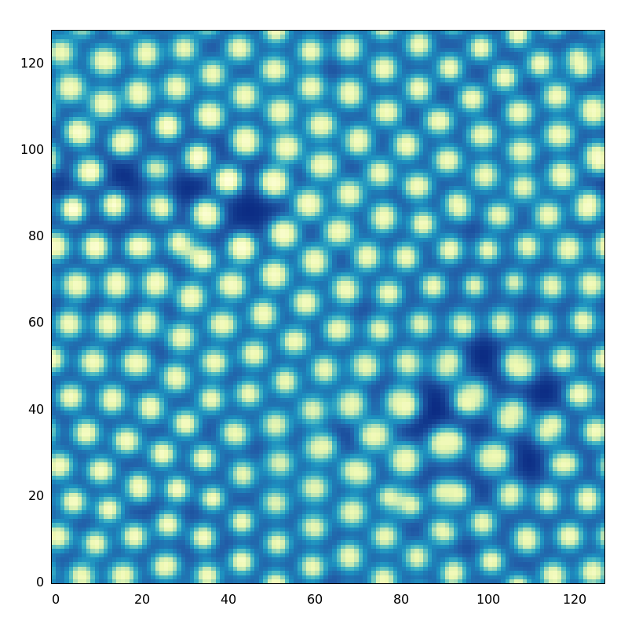

# Turing process integrator

Most stupid integrator possible, forward Euler solver of diffusion-reaction system. Mainly for practice with rust. To build, run `cargo build`. All configuration is hard-coded in the source. Just run the program (`cargo run rdint > out.txt`), piping to an output file. This code is *not* fast. To get some nice results it needs many (tens of) thousands of iterations.

This code reproduces results from Pearson 1993.

## Output

## Reference

- Pearson 1993 - DOI:10.1126/science.261.5118.189 
